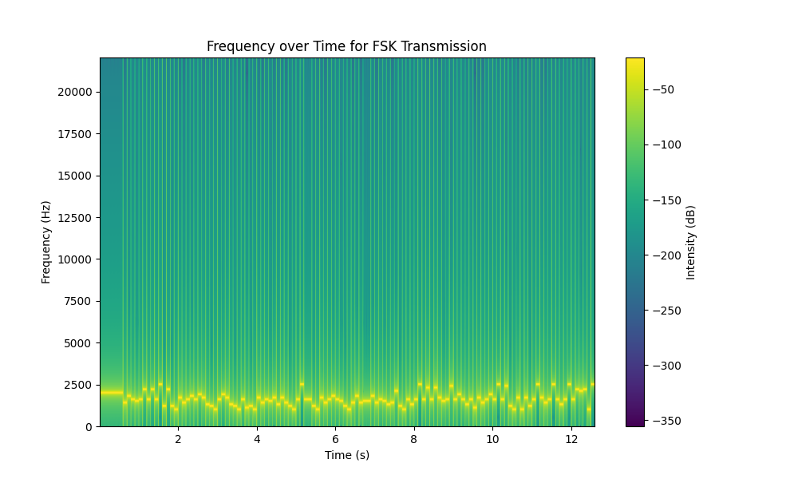

# HEXFSK-C2: WebSocket C2 over FSK Audio

This project demonstrates a proof-of-concept Command and Control (C2) framework that uses WebSockets for communication, but encodes the actual data (commands and responses) into Frequency-Shift Keying (FSK) audio signals embedded within WAV files.

## Overview

The system consists of two main components:

1.  **`server.py`**: A WebSocket server that listens for incoming agent connections. It provides an interactive console to list connected agents and send shell commands to them. Commands are encoded using FSK Map A.
2.  **`agent.py`**: A WebSocket client that connects to the server. Upon connection, it sends basic system information. It then listens for commands from the server (encoded using FSK Map A), executes them using `/bin/bash`, and sends back the output (encoded using FSK Map B).

Data is converted to hexadecimal, framed if necessary, wrapped with a preamble and end bit, modulated using FSK into an audio signal, saved as an in-memory WAV file, and transmitted as binary data over the WebSocket connection. The receiving end performs the reverse process.

## Features

*   Server-Agent architecture using WebSockets.
*   Data transmission via FSK modulation/demodulation encoded in WAV files.
*   Separate FSK frequency maps for server-to-agent (Map A) and agent-to-server (Map B) communication.
*   Basic packet structure (Preamble, Hex Payload, End Bit).
*   Framing mechanism to handle potentially large commands or responses.
*   Agent sends basic system information (OS, User, Admin Status, Shell) on connection.
*   Server provides an interactive console to manage agents and send commands.
*   Agent executes received shell commands using `/bin/bash`.
*   Colorized logging and UI elements (requires `colorama` and `pyfiglet`).
*   Optional debug mode (`--debug`) for verbose logging.

## How It Works

1.  **Plaintext to Hex:** Commands/data are converted to their hexadecimal representation.
2.  **Framing:** If the hex data exceeds `MAX_PAYLOAD_PER_FRAME`, it's split into multiple frames, each tagged with sequence numbers.
3.  **Packet Construction:** Each frame (or the entire message if not framed) is wrapped with a `PREAMBLE` and `END_BIT`.
4.  **FSK Encoding:** Each hex character in the packet is mapped to a specific frequency (using Map A or Map B). A sine wave tone is generated for each character for a fixed `symbol_duration`. These tones are concatenated to form the audio signal.
5.  **WAV Creation:** The raw audio signal is saved into an in-memory WAV file format.
6.  **WebSocket Transmission:** The binary WAV data is sent over the WebSocket connection.
7.  **Decoding (Reverse):** The receiver reads the WAV data, decodes the FSK signal back into hex characters by analyzing frequency components (FFT) of audio chunks, validates the preamble/end bit, reconstructs frames if necessary, and converts the hex payload back to plaintext.

## Prerequisites

*   Python 3.x
*   Required Python libraries:
    ```bash
    pip install numpy scipy websockets colorama pyfiglet
    ```

## Usage

1.  **Modify IP Address:** **IMPORTANT:** Before running, open both `server.py` and `agent.py` and change the hardcoded IP address (`192.168.1.102`) to the actual IP address where the server will be running.

2.  **Start the Server:**
    ```bash
    python server.py
    ```
    (Optional: `python server.py --debug` for verbose logging)
    The server will start listening and present an interactive menu.

3.  **Start the Agent:**
    On the target machine:
    ```bash
    python agent.py
    ```
    (Optional: `python agent.py --debug` for verbose logging)
    The agent will attempt to connect to the server's IP address.

4.  **Control via Server:** Use the server's interactive menu to:
    *   List connected clients (agents).
    *   Select a client ID and send a shell command.
    *   Broadcast a command to all connected clients.
    *   Exit the server.

## Disclaimer

This project is intended for educational and experimental purposes **only**. It demonstrates concepts of data encoding, modulation, and network communication.

*   **Security:** This implementation lacks encryption and proper authentication. Communication can be easily intercepted and decoded. Do **NOT** use this in any real-world sensitive environment.
*   **Ethics:** Using such tools without authorization on systems you do not own is illegal and unethical. The authors are not responsible for any misuse of this code.

## Potential Improvements

*   Implement encryption (e.g., encrypt the plaintext before hex conversion).
*   Add error correction codes to the FSK signal.
*   Improve robustness of FSK decoding (handling noise, timing variations).
*   Use configuration files instead of hardcoded values (IP, port, etc.).
*   Enhance agent capabilities (file transfer, etc.).
*   More robust error handling and connection management.